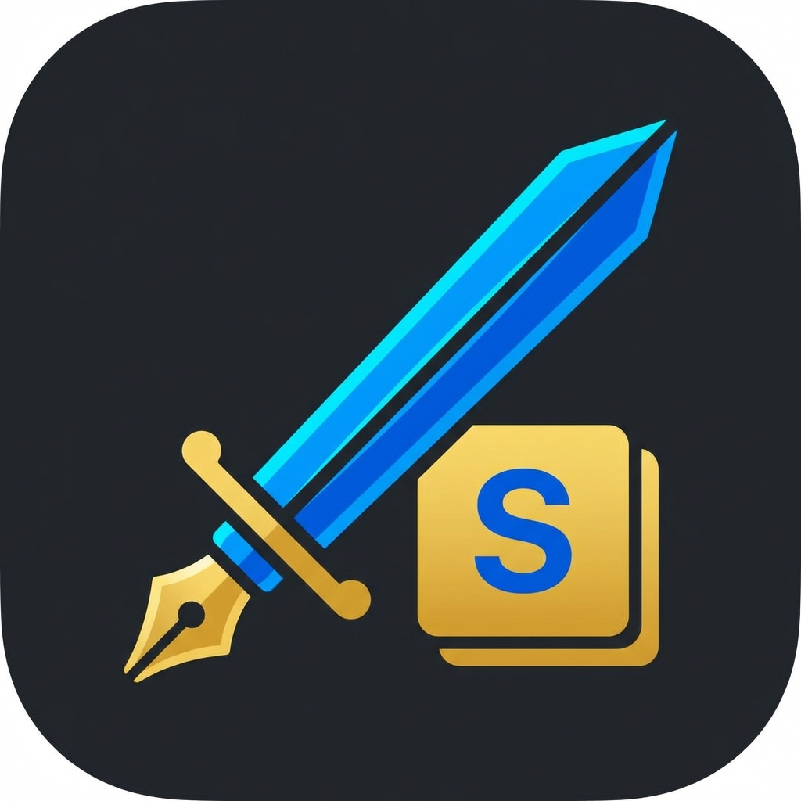

# SWORDLE - 4 Letter Word Game

SWORDLE is a sleek, modern version of the popular Wordle game, specifically designed for 4-letter words. Built with a focus on aesthetics and user experience, it features dynamic animations, sound effects, and a premium design.



## Features

- **4-Letter Word Challenges**: Every puzzle is a unique 4-letter word.
- **Modern UI**: Dark mode by default with vibrant colors and smooth "bounce" animations.
- **Sound & Music**: Toggleable background music and sound effects for an immersive experience.
- **Confetti Celebration**: Wins are celebrated with a colorful confetti burst!
- **PWA Support**: Installable as a standalone app on your desktop or mobile device.
- **Help Guide**: Built-in instructions for new players.

## How to Play

1. Guess the **SWORDLE** in 6 tries.
2. Each guess must be a valid 4-letter word.
3. Hit the **Enter** button to submit.
4. After each guess, the color of the tiles will change to show how close your guess was:
   - **Green**: The letter is in the word and in the correct spot.
   - **Yellow**: The letter is in the word but in the wrong spot.
   - **Gray**: The letter is not in the word in any spot.

## Getting Started

### Local Setup
Since this is a vanilla web project, you can simply open `index.html` in your browser. However, for the best experience (including manifest loading and potential API calls), it is recommended to run it using a local development server.

If you have Python installed, you can run:
```bash
python3 -m http.server
```
Then navigate to `http://localhost:8000` in your browser.

### Word List Management
The project includes Python scripts for managing the word list:
- `import_words.py`: Helps in importing new words.
- `convert_words.py`: Utility for word format conversion.
- `pydle.py`: Additional logic for word processing.

## Technologies Used

- **Frontend**: HTML5, CSS3, Vanilla JavaScript
- **Fonts**: [Fredoka](https://fonts.google.com/specimen/Fredoka) from Google Fonts
- **Animations**: CSS Keyframes & [Canvas Confetti](https://github.com/catdad/canvas-confetti)
- **Manifest**: `manifest.json` for PWA capabilities

## Authors

- **Sean Lane Fuller** - *Initial Work* - [seanlanefuller](https://github.com/seanlanefuller)

## License

This project is licensed under the MIT License - see the [LICENSE.md](LICENSE.md) file for details.

Copyright © 2025 Sean Lane Fuller. All rights reserved.
